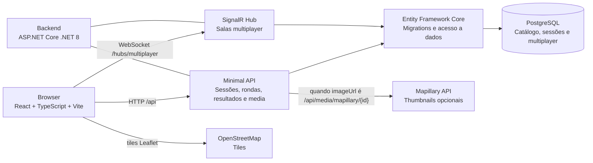

# C4 Contentores

Este diagrama mostra os contentores principais do projeto e como comunicam em modo real.

## Responsabilidades

| Contentor | Responsabilidade |
|-----------|------------------|
| Frontend React/Vite | Interface do jogo, mapa, fluxo solo, lobby multiplayer e ligação ao SignalR. |
| Backend ASP.NET Core | Contratos HTTP, validações server-side, cálculo de resultados, seleção de rondas, media Mapillary e hub multiplayer. |
| PostgreSQL | Guarda catálogo de locais, sessões solo, rondas, salas multiplayer, jogadores e palpites. |
| Entity Framework Core | Cria/evolui o schema com migrations e evita queries SQL manuais no código da aplicação. |
| OpenStreetMap/Leaflet | Mostra o mapa real usado para marcar palpites. |
| Mapillary | Fonte opcional; o frontend nunca recebe o token. |

## Execução

O perfil `full` do Docker Compose arranca frontend em modo `api`, backend e PostgreSQL. O perfil `frontend-mock` continua útil para demonstração rápida sem backend.
