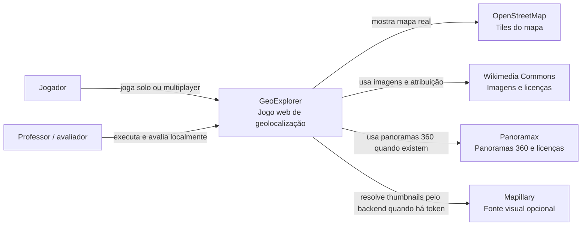

# C4 Contexto

Este diagrama mostra o GeoExplorer como sistema principal e as dependências externas que uso para mapa e fontes visuais.

## Leitura rápida

- O GeoExplorer corre localmente ou em Docker, sem depender de cloud própria.
- O jogo usa um conjunto local de locais reais para reduzir risco durante a demonstração.
- OpenStreetMap é usado para o mapa interativo.
- Wikimedia Commons e Panoramax podem ser fontes principais de ronda.
- Panoramax e Mapillary também podem entrar como fontes adicionais quando têm cobertura útil.
- Mapillary não é obrigatório para correr o jogo; o token fica no ambiente local e o backend resolve thumbnails quando necessário.
