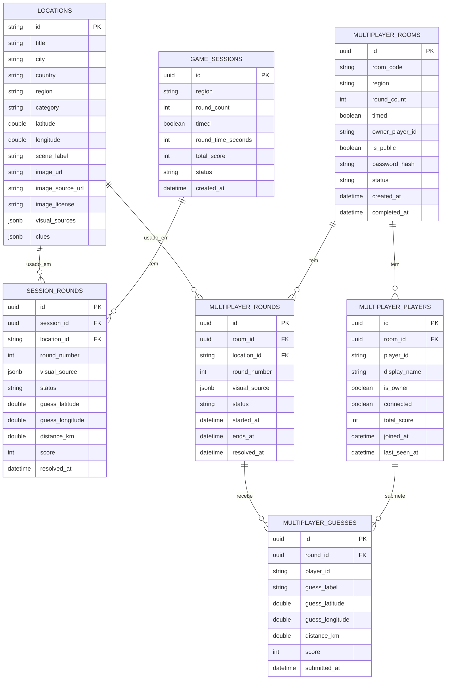

# Modelo de Dados PostgreSQL

O schema principal é criado pelas migrations do Entity Framework em `src/backend/Data/Migrations`.

## Notas

- `locations` guarda o catálogo real e as fontes visuais disponíveis por local.
- `session_rounds.visual_source` e `multiplayer_rounds.visual_source` guardam a fonte escolhida para a ronda, para manter consistência quando a sessão é recuperada.
- `multiplayer_rooms.password_hash` guarda apenas o hash da password da sala, quando existe.
- `multiplayer_guesses.player_id` liga o palpite ao identificador lógico do jogador dentro da sala.
