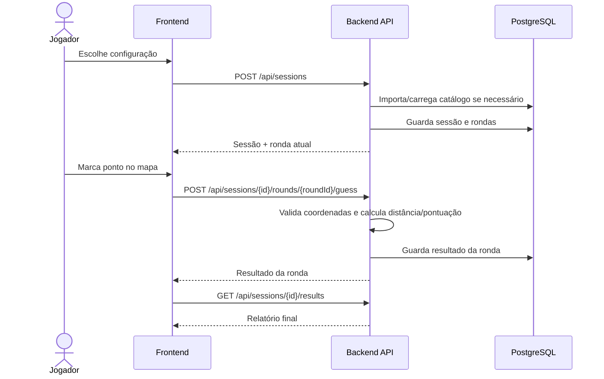
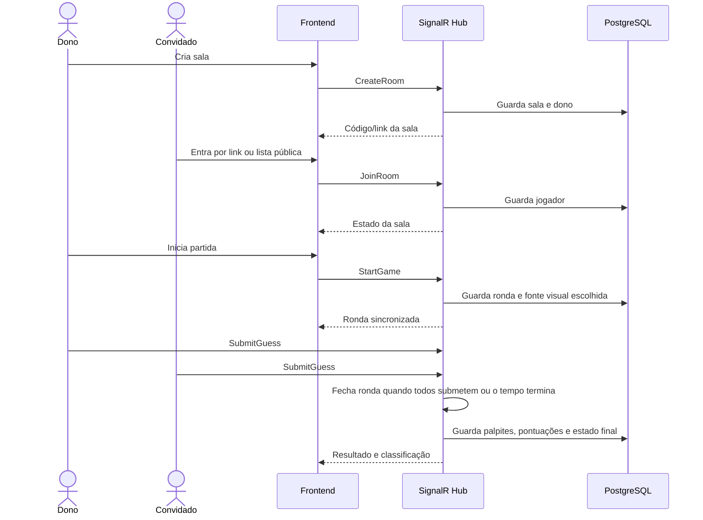

# Fluxos de Jogo

## Fluxo Solo

## Fluxo Multiplayer

## Regras principais

- No modo solo e no multiplayer, cada jogador só submete um palpite por ronda.
- O backend valida coordenadas, labels e códigos de sala.
- No multiplayer, o dono escolhe a configuração antes de iniciar.
- O resultado da ronda multiplayer aparece quando todos os jogadores ativos submetem ou quando o tempo termina.
- O frontend em modo `mock` mantém a demonstração rápida, mas o modo `api` é o fluxo real.
