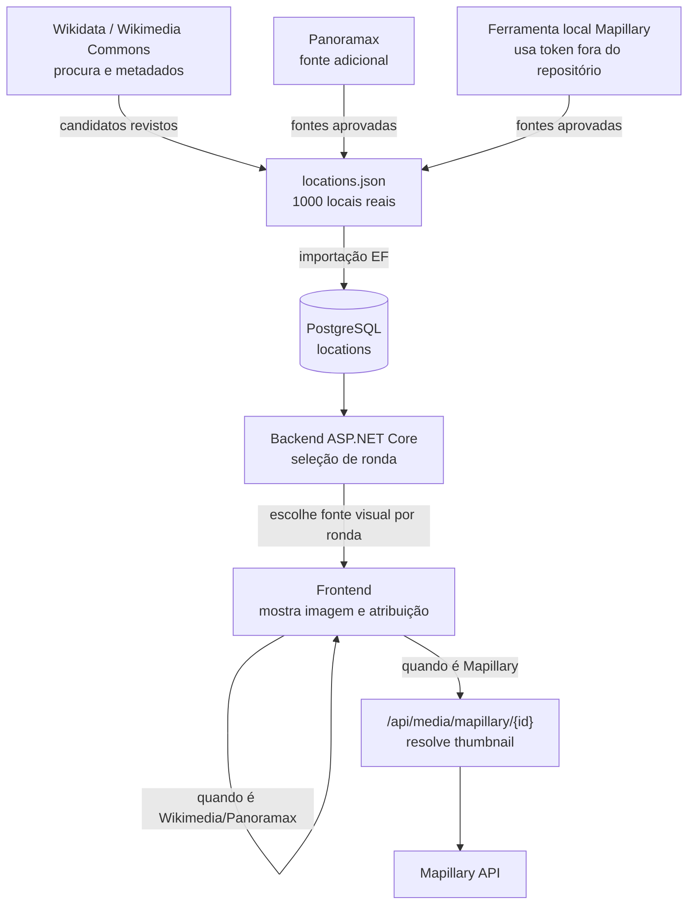

# Fontes Visuais

O GeoExplorer usa um dataset local para reduzir dependência de serviços externos durante o jogo. Cada local tem uma fonte principal e pode ter fontes adicionais em `visualSources`.

## Decisões

- Wikimedia Commons é a fonte principal porque fornece imagem, página de origem, licença e atribuição.
- Panoramax é usado quando há cobertura útil e dados suficientes.
- Mapillary é opcional: guardo um caminho estável do backend e não URLs temporários da API.
- A fonte visual escolhida por ronda fica guardada na base de dados, para o resultado continuar consistente.
- O token Mapillary fica apenas no ambiente local através de `MAPILLARY_ACCESS_TOKEN`.
