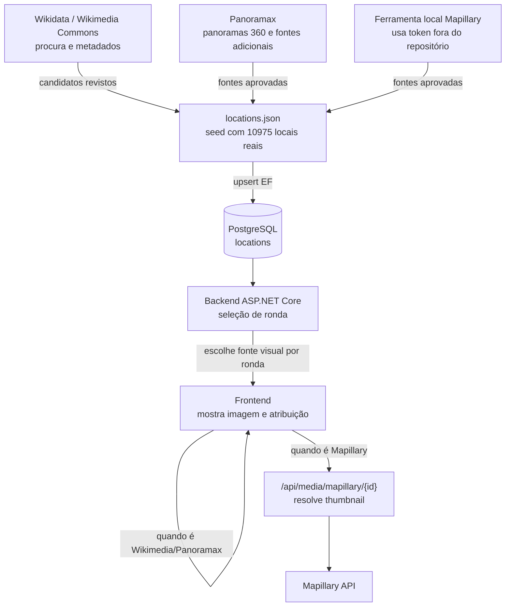

# Fontes Visuais

O GeoExplorer usa um dataset local como seed controlado para reduzir dependência de serviços externos durante a preparação dos dados. Em runtime real, o catálogo é sincronizado para PostgreSQL por upsert e servido pela API, para o frontend não ter de carregar o `locations.json` completo. Cada local tem uma fonte principal e pode ter fontes adicionais em `visualSources`.

## Preparação do catálogo

## Fallbacks em runtime

- PostgreSQL é a origem do catálogo jogável quando `GeoExplorer__UsePostgresCatalog=true`; `locations.json` fica como seed/fallback controlado.
- Mapillary só entra na escolha da fonte visual se existir `MAPILLARY_ACCESS_TOKEN`; sem token, essas fontes são ignoradas.
- Se a imagem escolhida falhar no frontend, a interface tenta outras fontes visuais do mesmo local antes de mostrar imagem indisponível.
- A fonte visual escolhida fica guardada com a ronda, para o resultado e a recuperação de sessão mostrarem a mesma fonte.

## Estado atual

- 10975 locais reais no dataset.
- 5513 locais têm Wikimedia Commons como fonte principal.
- 5462 locais têm Panoramax como fonte principal jogável.
- 1844 locais têm Mapillary como fonte visual adicional opcional.
- 5553 locais têm Panoramax como fonte visual adicional.
- O ficheiro `locations.json` funciona como seed/fonte controlada; no fluxo real a seleção de rondas passa pela API e pela tabela `locations` em PostgreSQL.

## Decisões

- Wikimedia Commons e Panoramax podem ser fontes principais de ronda, desde que tenham imagem, página de origem, licença e atribuição suficientes.
- Panoramax é usado quando há cobertura útil e dados suficientes para uma vista jogável.
- Mapillary é opcional: guardo um caminho estável do backend e não URLs temporários da API.
- A fonte visual escolhida por ronda fica guardada na base de dados, para o resultado continuar consistente.
- O token Mapillary fica apenas no ambiente local através de `MAPILLARY_ACCESS_TOKEN`.
